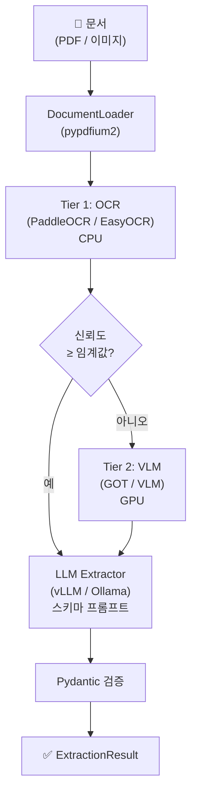

# Docpick

[](https://pypi.org/project/docpick/)
[](https://pypi.org/project/docpick/)
[](https://github.com/QuartzUnit/docpick/blob/main/LICENSE)
[]()

> [English](README.md)

문서를 넣으면 구조화된 JSON이 나옵니다. 로컬에서. 내 스키마로.

**docpick**은 로컬 OCR 엔진과 로컬 LLM을 결합하여 어떤 문서든 — 송장, 영수증, 선하증권, 세금계산서 등 — 구조화된 JSON으로 추출하는 경량 스키마 기반 파이프라인입니다.

- **클라우드 의존성 제로** — CPU 또는 GPU에서 완전히 로컬 실행
- **커스텀 스키마** — Pydantic 모델을 직접 정의하거나 8개 내장 스키마 사용
- **검증 내장** — 체크디짓 검증, 교차 필드 규칙, 교차 문서 일관성
- **Apache 2.0** — GPL/AGPL 의존성 없음

## 설치

```bash
pip install docpick            # 코어 (LLM 추출만)
pip install docpick[paddle]    # + PaddleOCR (권장)
pip install docpick[easyocr]   # + EasyOCR (한국어 최적화)
pip install docpick[got]       # + GOT-OCR2.0 (GPU, 비전-언어)
pip install docpick[all]       # 모든 OCR 백엔드
```

**요구사항:** Python 3.11+ / LLM 엔드포인트 (vLLM, Ollama, 또는 OpenAI 호환)

## 빠른 시작

### Python API

```python
from docpick import DocpickPipeline
from docpick.schemas import InvoiceSchema

pipeline = DocpickPipeline()
result = pipeline.extract("invoice.pdf", schema=InvoiceSchema)

print(result.data)           # 스키마에 맞는 구조화된 dict
print(result.validation)     # 검증 오류/경고
print(result.confidence)     # 필드별 신뢰도 점수
```

### CLI

```bash
# 구조화 데이터 추출
docpick extract invoice.pdf --schema invoice --output result.json

# OCR만 (LLM 없이)
docpick ocr document.png --lang ko,en

# 추출된 JSON 검증
docpick validate result.json --schema invoice

# 디렉토리 일괄 처리
docpick batch ./documents/ --schema invoice --output ./results/ --concurrency 4

# 사용 가능한 스키마 목록
docpick schemas list

# 스키마 상세 보기
docpick schemas show invoice
```

## 내장 스키마

| 스키마 | 문서 유형 | 주요 검증 |
|--------|----------|----------|
| `invoice` | 상업 송장 | 라인 항목 합계, 세금 ID 체크디짓, 날짜 순서 |
| `receipt` | 소매/음식점 영수증 | 합계 = 소계 + 세금 + 팁 |
| `bill_of_lading` | 해상/항공 선하증권 | 컨테이너 중량 합계, ISO 6346, HS 코드 형식 |
| `purchase_order` | 구매 주문서 | PO 합계 = 라인 항목, 납기 날짜 순서 |
| `kr_tax_invoice` | 한국 전자세금계산서 | 사업자번호 체크디짓 (×2), 공급가액/세액/합계 |
| `bank_statement` | 은행 거래내역서 | IBAN mod97, 기간 날짜 순서 |
| `id_document` | 여권/신분증 (ICAO 9303) | MRZ, ISO 3166 국가코드, 날짜 범위 |
| `certificate_of_origin` | 원산지증명서 | ISO 3166 alpha-2 국가코드 |

## 커스텀 스키마

Pydantic으로 직접 정의:

```python
from pydantic import BaseModel
from docpick import DocpickPipeline
from docpick.validation.rules import SumEqualsRule, RequiredFieldRule

class MyDocument(BaseModel):
    """커스텀 문서 스키마."""
    company_name: str | None = None
    total_amount: float | None = None
    tax_amount: float | None = None
    net_amount: float | None = None
    items: list[dict] | None = None

    class ValidationRules:
        rules = [
            RequiredFieldRule("company_name"),
            SumEqualsRule(["net_amount", "tax_amount"], "total_amount"),
        ]

pipeline = DocpickPipeline()
result = pipeline.extract("my_document.pdf", schema=MyDocument)
```

또는 JSON Schema 파일로:

```bash
docpick extract document.pdf --schema my_schema.json
```

## 검증

### 체크디짓 알고리즘

| 알고리즘 | 용도 |
|---------|------|
| `kr_business_number` | 한국 사업자등록번호 (10자리) |
| `luhn` | 신용카드 번호 |
| `iso_6346` | 해상 컨테이너 번호 |
| `iban_mod97` | 국제 은행 계좌 번호 |
| `awb_mod7` | 항공 화물 운송장 번호 |
| `mrz` | 기계판독영역 (여권/신분증) |

### 교차 필드 규칙

| 규칙 | 설명 |
|------|------|
| `SumEqualsRule` | 필드 합계가 대상과 일치 (허용 오차 포함) |
| `DateBeforeRule` | 날짜 A가 날짜 B보다 앞 |
| `RequiredFieldRule` | 필드가 null/빈 값이 아닌지 검증 |
| `FieldEqualsRule` | 두 필드가 동일한지 검증 |
| `RangeRule` | 숫자 필드가 최소/최대 범위 내 |
| `RegexRule` | 필드가 정규식 패턴에 일치 |

### 교차 문서 검증

관련 문서 간 일관성 검증 (예: 송장 + 선하증권 + 패킹리스트):

```python
from docpick.validation.cross_document import create_trade_document_validator

validator = create_trade_document_validator()
result = validator.validate({
    "invoice": invoice_data,
    "bl": bl_data,
    "packing_list": packing_list_data,
    "certificate": certificate_data,
})
print(result.is_valid)
```

## OCR 엔진

| 엔진 | 유형 | GPU | 언어 수 | 적합 대상 |
|------|------|-----|--------|----------|
| PaddleOCR | 전통 OCR | 선택 | 111 | 일반 문서 (기본값) |
| EasyOCR | 전통 OCR | 선택 | 80+ | 한국어 텍스트 |
| GOT-OCR2.0 | 비전-언어 | 필수 | 다국어 | 복잡한 레이아웃 |
| VLM | 비전-언어 | 필수 | 다국어 | 이미지 → JSON 직접 변환 |

### 2-Tier 자동 엔진

기본 `auto` 엔진은 신뢰도 기반 폴백을 사용합니다:

1. **Tier 1 (CPU):** PaddleOCR → EasyOCR
2. **Tier 2 (GPU):** GOT-OCR2.0 → VLM

Tier 1 평균 신뢰도가 임계값(기본 0.7) 미만이면 자동으로 Tier 2로 에스컬레이션합니다.

## LLM 프로바이더

| 프로바이더 | 엔드포인트 | 기본 모델 |
|-----------|----------|----------|
| vLLM | `http://localhost:8000/v1` | Qwen/Qwen3.5-32B-AWQ |
| Ollama | `http://localhost:11434` | qwen3.5:7b |

CLI 또는 YAML로 설정:

```bash
docpick config set llm.provider ollama
docpick config set llm.base_url http://localhost:11434
docpick config set llm.model qwen3.5:7b
```

## 에러 처리

파이프라인은 복원력 있게 설계되었습니다:

- **OCR 실패** → 다음 가용 엔진으로 자동 폴백
- **LLM JSON 파싱 실패** → 교정 프롬프트로 자동 재시도 (최대 1회)
- **부분 결과** → 추출된 것만 반환, 에러는 `result.errors`에 기록
- **문서 로드 실패** → 에러 메시지와 함께 빈 결과 반환

```python
result = pipeline.extract("damaged.pdf", schema=InvoiceSchema)
if result.errors:
    print("파이프라인 경고:", result.errors)
if result.data:
    print("부분 추출:", result.data)
```

## 일괄 처리

병렬 워커로 디렉토리 전체 처리:

```python
from docpick.batch import BatchProcessor
from docpick.schemas import InvoiceSchema

processor = BatchProcessor(concurrency=4)
result = processor.process_directory(
    "./invoices/",
    schema=InvoiceSchema,
    recursive=True,
)

print(f"처리 완료 {result.succeeded}/{result.total} 파일")
for path, extraction in result.results.items():
    print(f"{path}: {extraction.data.get('total_amount')}")
```

## 아키텍처



## 라이선스

Apache 2.0 — 모든 의존성이 Apache 2.0 또는 MIT 라이선스입니다.
